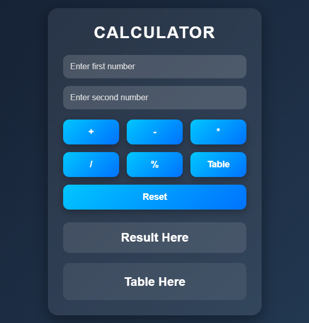

# Calculator App

A simple calculator made with HTML, CSS, and JavaScript.

## 🚀 Live Demo
👉 https://officialalihassandev.github.io/Calculator/

## Screenshot

## Features
- Addition
- Subtraction
- Multiplication
- Division
- Responsive Design

## Technologies Used
- HTML
- CSS
- JavaScript

## Author
Ali Hassan
